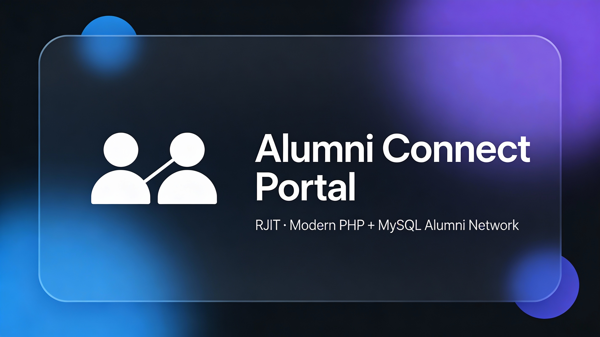

<p align="center">
  
</p>

<h1 align="center">Alumni Connect Portal</h1>

<p align="center">
  <a href="https://shirooni.infinityfree.me/Alumini/">
    
  </a>
  
  <a href="./includes/security_helper.php">
    
  </a>
  
  <a href="./database.sql">
    
  </a>
  <a href="./LICENSE">
    
  </a>
</p>

<p align="center">
  <strong>Nexus Alumini Extreme:</strong> A hardened PHP + MySQL command center featuring atomic moderation, real-time audit logging, and glassmorphism UI.
</p>


---

## Table of Contents

- [Features](#features)
- [Tech Stack](#tech-stack)
- [Live Demo](#live-demo)
- [Getting Started](#getting-started)
- [Project Structure](#project-structure)
- [Core Flows](#core-flows)
- [Changelog](./CHANGELOG.md)
- [Contributing](#contributing)
- [License](#license)

---


## Features (Supreme Edition)

- **Extreme Moderation Suite:** Full control over alumni, posts, and comments with **Atomic Transactions** and row-level locking to prevent data loss.
- **Nexus Social Hub:** Centralized command center for hosting community events and dispatching global broadcasts.
- **Glassmorphism Global Search:** A non-disruptive, real-time search engine for instant data retrieval across the entire portal.
- **Audit Logging & Accountability:** Every administrative action is logged with IP addresses and metadata for high-level security tracking.
- **Hardened Security:** Centralized **CSRF Protection** via `security_helper.php` and SQL injection prevention using prepared statements.
- **Live Notifications:** Real-time feedback loop for post approvals and event updates.

---

## Tech Stack & Security

- **Backend:** PHP 8.2+ with strictly typed declarations and MySQLi.
- **Database:** Optimized Relational Schema with **Foreign Key Constraints** and **Atomic Integrity**.
- **Frontend:** Glassmorphism UI powered by Bootstrap 5, Lucide Icons, and Vanilla JS.
- **Security Guard:** Cross-Site Request Forgery (CSRF) protection and session-based authentication guards on all entry points.

---

## Live Demo

The project is deployed at:

> https://shirooni.infinityfree.me/Alumini/

Use this URL to quickly verify UI behaviour in different browsers and devices. [web:587]  

---

## Getting Started

### 1. Clone
git clone https://github.com/0902cs231028-sys/Alumini.git
cd your-repo
### 2. Database Setup

1. **Create Database:** Open your MySQL manager (phpMyAdmin/Terminal) and create a new database named `alumni_portal`.
2. **Import Schema:** Import the [database.sql](./database.sql) file located in the root directory. This will automatically build all **7 core tables**, including the Audit Logs and Social Hub schema.
3. **Configure Connection:** Navigate to `includes/connection.php` and update the following variables to match your environment:
   ```php
   $host = 'localhost';
   $user = 'your_username';
   $pass = 'your_password';
   $db   = 'alumni_portal';

### 3. Run locally

Using PHP’s built‑in server:php -S localhost:8000

Then open `http://localhost:8000` in a browser. [web:490]  

Create an initial admin/alumni account directly in the DB or via a seed script, then log in via:

- `/login.php` — alumni login  
- `/register.php` — alumni registration  
- `/admin/admin_login.php` — admin dashboard login  

---

## Project Structure
.
├── admin/
│   ├── admin_login.php      # Admin authentication portal
│   ├── dashboard.php        # Extreme metrics & operational overview
│   ├── social_hub.php       # Social command center (Events/Broadcasts)
│   ├── global_search.php    # AJAX backend for glassmorphism search
│   ├── manage_posts.php     # Supreme moderation terminal
│   ├── approve_post.php     # Atomic post moderation & notifications
│   ├── delete_comment.php   # Hardened comment purge logic
│   └── logs.php             # Live system audit trail terminal
├── assets/
│   └── banner.png           # Project branding
├── includes/
│   ├── connection.php       # Database link (Configuration required)
│   ├── security_helper.php  # CSRF & Security token engine
│   └── functions.php        # Core utility logic
├── css/
│   └── style.css            # Glassmorphism & Extreme UI variables
├── js/
│   ├── app.js               # Theme engine & UI effects
│   └── comment.js           # AJAX comment threading logic
├── uploads/
│   └── profile_pics/        # Admin/Alumni avatar storage
├── database.sql             # Full v1.0.0-SUPREME database schema
├── CHANGELOG.md             # Project evolution & version history
├── LICENSE                  # MIT Legal documentation
└── README.md                # Supreme system documentation

- `css/style.css` – theme variables, glass cards, tables, buttons, menu styling. [web:474][web:521]  
- `js/app.js` – theme toggle, OS‑theme listener, button ripple effect. [web:408][web:607]  
- `fetch_comments.php` – JSON API for comments attached to posts. [web:546][web:550]  

---

## Core Flows

### Alumni Registration

- `register.php`  
  - Validates required fields and email format.  
  - Hashes password before inserting into the `alumni` table. [web:468][web:540]  
  - New accounts are pending until an admin marks them approved. [web:501]  

### Login & Session

- `login.php`  
  - Looks up an approved alumni by email using prepared statements. [web:534][web:299]  
  - Verifies the password with `password_verify` and sets `$_SESSION['alumni_id']`. [web:533]  

### Profile Management

- `profile.php`  
  - Requires an authenticated alumni session. [web:319]  
  - Lets users edit name, batch, branch, phone, city, and LinkedIn URL via a prepared `UPDATE`. [web:374][web:549]  

## Admin Tools (The Command Center)

- `admin/dashboard.php` – High-performance overview with dynamic fail-safe metrics.
- `admin/social_hub.php` – The pulse of the community: manage events and broadcasts.
- `admin/approve_post.php` – Supreme moderator with author notification triggers.
- `admin/global_search.php` – Backend engine for the AJAX-powered search overlay.
- `admin/logs.php` – Live terminal for system audit trails.

### Comments API

- `fetch_comments.php`  
  - Accepts `GET post_id`.  
  - Returns an ordered JSON array of comments (id, content, created_at, alumni_id, name). [web:546][web:560]  

---

## Contributing

Contributions and suggestions are welcome to the Nexus Alumini project. To maintain the **Extreme** standard of this repository, please follow these steps:

1. **Fork the Repo:** Create your own copy of the project.
2. **Branching:** Create a feature branch: `git checkout -b feature/awesome-idea`.
3. **Commit Standards:** Use clear, descriptive commit messages.
4. **Documentation:** If you add or change functionality, you **must** update the following:
   - [README.md](./README.md): Update technical specifications or setup instructions.
   - [CHANGELOG.md](./CHANGELOG.md): Document your changes under the `[Unreleased]` section following the "Keep a Changelog" format.
5. **Pull Request:** Open a PR to the `main` branch for review.

---


## License

This project is released under the **MIT License**. See the [LICENSE](./LICENSE) file for the full legal text.

